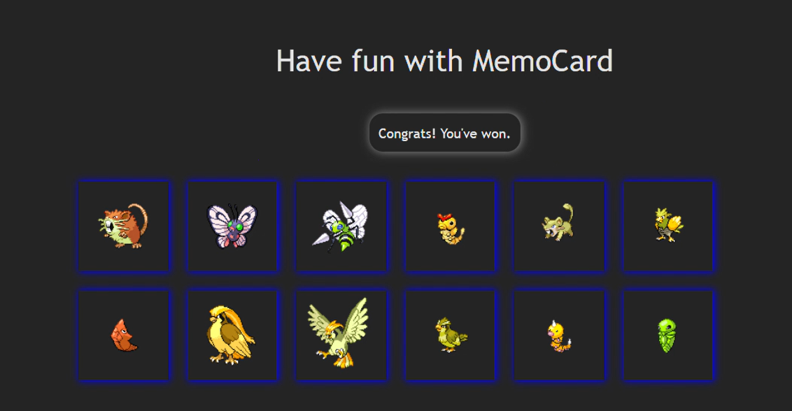

# MemoCard

**Test your memory. Beat your best. Laugh when you fail.**

MemoCard is a quick memory game. Click each card only once. If you repeat, your score drops to zero. The cards shuffle every time. Get all 12 and you win. Miss one, and you’re back to square one.

---

## Why MemoCard?

I love games that are easy to start and tough to master. MemoCard is just that. The Pokémon images? Just for fun.

---

## How to Play

1. Click any card to start.
2. Each new card = +1 point.
3. Click a card you’ve already picked? Score resets.
4. Get all 12 unique cards and you win.
5. The cards shuffle after every click.

---

## Win & Lose Scenarios

**Win:**


You made it! If you click all 12 cards without repeating, you get a little celebration. Enjoy the win. Brag if you want.

**Lose:**
Click a card twice? The game resets. Maybe laugh, maybe groan, but you’ll want to try again.

---

## Features

- Fast interface
- Scoreboard
- Pokémon images
- Works on any screen

---

## Get Started

1. Clone this repo:
   ```
   git clone https://github.com/benxta4424/MemoCard.git
   ```
2. Install dependencies:
   ```
   npm install
   ```
3. Start the game:
   ```
   npm run dev
   ```
4. Open your browser at `http://localhost:5173`

---

## Tech

- React
- Vite
- JavaScript (ES6+)
- CSS

---

MemoCard is for anyone who likes a quick challenge and a bit of fun. Got ideas, found a bug, or want to brag about your high score? Open an issue or drop a message. Thanks for playing!